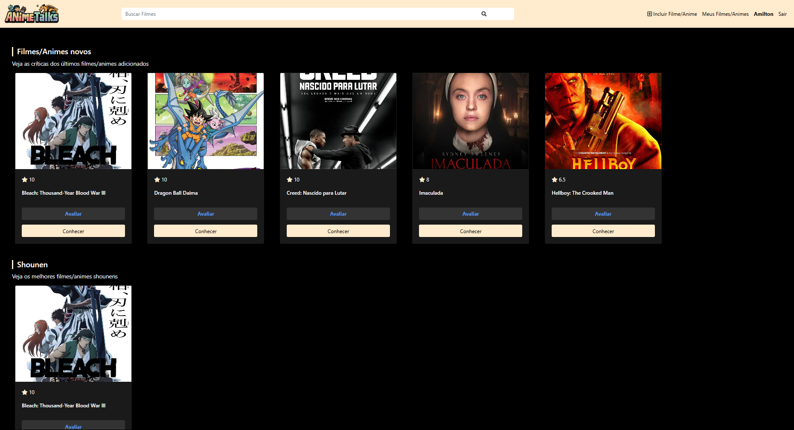
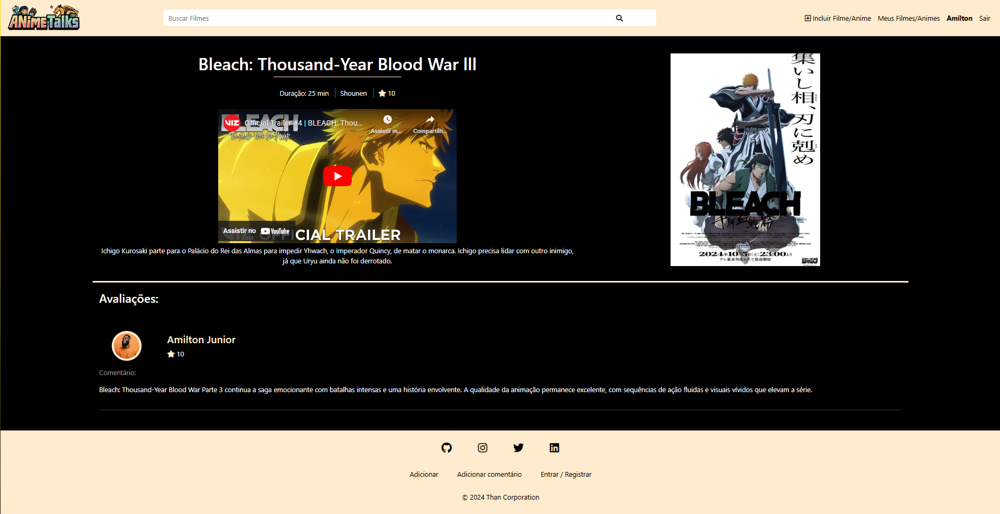
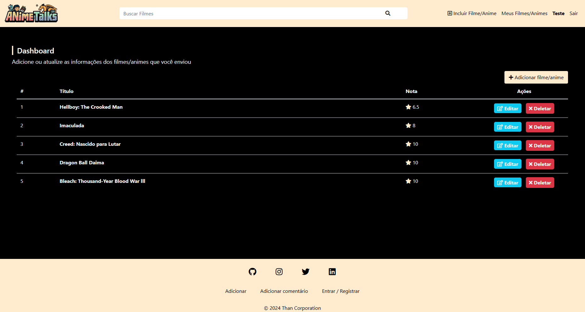
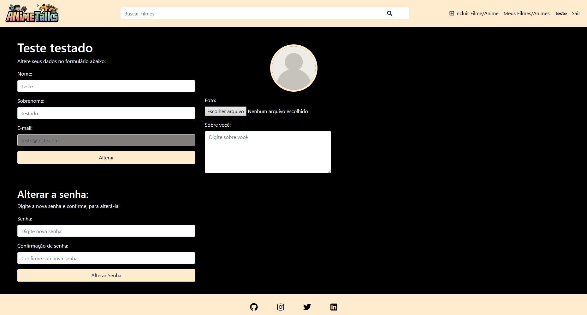

# **Site de Discussão de Animes e Filmes**

### **Descrição:**

Este é um projeto de um site de discussão sobre animes e filmes. O site permite aos usuários fazer login, adicionar informações sobre animes e filmes, avaliar, comentar, e gerenciar seus próprios itens no site. O projeto foi desenvolvido com PHP utilizando Programação Orientada a Objetos (POO), e o layout é estilizado com CSS e Bootstrap.

***

## **Funcionalidades**

### ***Página Inicial***

- **Últimos itens adicionados:** Exibe os animes e filmes mais recentes cadastrados.
- **Exibição por categorias:** Organiza os itens por categorias para fácil navegação.
- **Botões de interação:** Embaixo de cada item, há botões para avaliar e conhecer mais detalhes sobre o anime ou filme.

### ***Detalhes do Filme/Anime***

- **Trailer:** Assista ao trailer do item.
- **Duração:** Visualize a duração total do anime ou filme.
- **Comentários:** Faça um comentário sobre o item (somente um comentário por usuário).
- **Avaliação:** Atribua uma nota de 0 a 10 ao item.

### ***Meus Filmes/Animes***

- **Visualização dos itens adicionados:** Acesse todos os itens que você adicionou ao site.
- **Editar e excluir:** Possibilidade de editar informações ou excluir itens cadastrados.

### ***Perfil do Usuário***

- **Editar perfil:** Permite alterar o nome e as informações de conta.
- **Alterar senha:** Possibilidade de atualizar a senha de login.

###***Funcionalidade de Busca***

- **Buscar filmes/animes:** Barra de pesquisa para localizar rapidamente um anime ou filme.

***

## **Tecnologias Utilizadas**

- **PHP:** Backend do site, utilizando Programação Orientada a Objetos (POO).
- **CSS & Bootstrap:** Para o design responsivo e estilização das páginas.

***

## **Licença

Este projeto está licenciado sob a Licença MIT - veja o arquivo [LICENSE](LICENSE) para mais detalhes.
